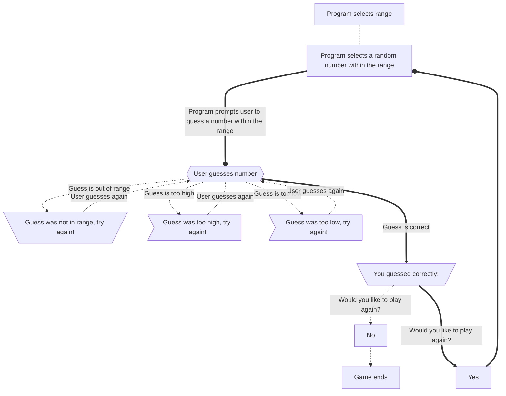

    
### Number Guessing Game Flow Chart Description
 1. The program must pick a **random** number within a selected range.
 2. The user is prompted to guess the random number selected by the program
    - **If the user selects a number thats too high.**
        1. The program lets the user know that the value they selected was too high.
        2. The program prompts the user to try again.
    - **If the user selects a number thats too low.**
        1. The program lets the user know that the value they selected was too low.
        2. The program prompts the user to try again.
    - **If the user selects the correct number.**
        1. The program lets the user know that the value they selected was correct.
        2. The program asks the user if they want to play again.
            1. The user selects yes and the program starts over.
            2. The user selects no and the game ends.